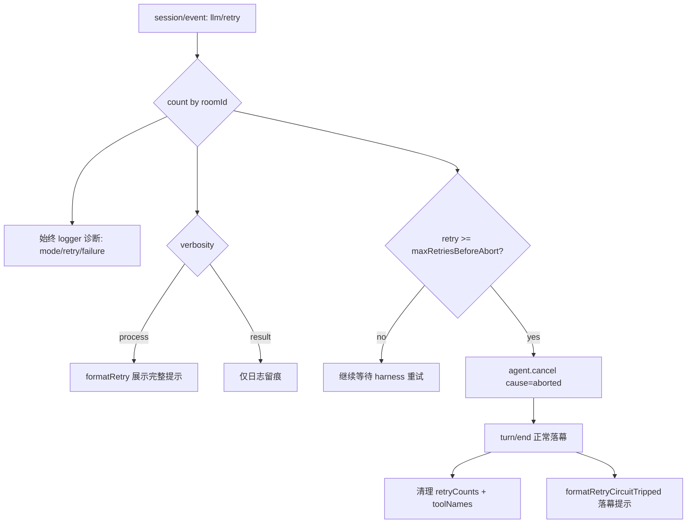

## 用户需求
用户从 token 消耗角度发现 harness 存在“轮询式”无限重试导致成本过高，要求改为事件驱动。经澄清确认：当前 dsh-matrix 插件层本身已是事件驱动（Matrix /sync 为服务端挂起长轮询、出站依赖 session/event 回调），真正烧 token 的是 harness 内核 `llm-retry` 的 `always` 无上限重试。本次任务在 dsh-matrix 插件层（不修改 harness 内核）完成两件事：先增强 retry 诊断可见性，再加“重试熔断”兜底。

## 产品概述
dsh-matrix 作为 DeepSeek Harness 的 Matrix 适配器，需要让用户看清每次 LLM 重试的模式（normal/always）、次数、上限与失败原因，并在同一房间重试达到阈值（默认 5 次）时，由插件主动调用 `agent.cancel()` 终止当前 turn，以事件驱动方式停止无意义的重复推理，避免 token 持续浪费。

## 核心特性
- retry 诊断增强：过程模式完整展示重试模式/次数/上限/延迟/原因；结果模式在日志中留痕重试来源与 always 无上限警示。
- 重试熔断兜底：按房间累计 `llm/retry` 的 `retry` 序号，达 `maxRetriesBeforeAbort`（默认 5）即调用 `agent.cancel()` 终止 turn，并落幕提示用户。
- 可配置与可关闭：新增 `maxRetriesBeforeAbort` 配置项（默认 5）与熔断开关，避免误伤偶发限流。
- 资源清理：计数随 `turn/end` 清理，与既有 `toolNames` 一致，无内存增长。


## 技术栈
- 语言/运行时：TypeScript（strict）+ Node.js ESM，与现有项目一致。
- 宿主契约：`@deepseek-ai/dsh-session`（SessionEventMap）、`@deepseek-ai/dsh-agent`（Agent.cancel）。不修改 harness 源码，保持适配器边界。
- 构建：`npx tsc -p tsconfig.json`（无 pnpm）；测试：`node --test`（编译后 `lib/`）。
- 纯投影函数沿用 `src/format.ts`；`src/bridge.ts` 负责事件分发、计数与熔断编排。

## 实现方案
**策略**：在 `handleSessionEvent` 的 `llm/retry` case 中，把“仅 process 模式展示”升级为“始终计数 + 始终日志诊断 + 达阈值熔断”。熔断通过 `this.roomAgents.get(roomId)?.agent.cancel(cause)` 触发，复用 harness 已有的 abort→turn/end 链路，落幕提示复用 `safeSend`/`formatTurnEnd` 风格文本。

**关键决策与取舍**
1. **根因在 harness，适配层只做观察与熔断**：`retryPolicy` 属于 provider 配置，插件无法覆盖；但插件可观察 `llm/retry` 事件（含 `retry`/`maxRetries`/`failure`）并在超限时 `agent.cancel()`。这是最小且正确的方案，不侵入内核。
2. **熔断阈值默认 5（用户指定）**：给模型更多恢复机会，同时避免偶发限流被误杀；通过 `Config.maxRetriesBeforeAbort` 暴露，且提供 `retryCircuitBreakerEnabled`（默认 true）可整体关闭。
3. **计数按房间独立**：新增 `retryCounts: Map<roomId, number>`，每次 `llm/retry` 取 `data.retry`（事件自带序号，可信）更新；`turn/end` 时与 `toolNames` 一并清理，避免内存增长。
4. **诊断增强**：`formatRetry` 对 `always` 模式（无 `maxRetries`）补充“无上限退避”警示标识；过程模式仍展示完整提示，结果模式新增日志留痕（roomId、retry、mode、failure 原因），便于事后复盘。
5. **熔断落幕文本**：新增 `formatRetryCircuitTripped(roomId, retry)` 生成明确提示，说明“已达 N 次重试上限，已终止本次会话以止损”，经 `safeSend` 投递。
6. **性能/可靠性**：计数为 O(1) Map 读写；`cancel` 为现有 API，无额外 IO；熔断仅在阈值边界触发一次，幂等（cancel 后 turn 结束，后续 retry 不再到达或超过计数后直接忽略）。

## 实现笔记
- 复用现有 `safeSend`、`formatTurnEnd` 文本风格、`roomVerbosity` 读取；不新增运行时依赖。
- `agent.cancel()` 的 `cause` 使用 harness 已定义的 `AgentCancelCause`（如 `'aborted'`/`'interrupted'`），具体取值以 `dsh-agent` 类型为准；若类型不便导入，用最小兼容字符串并经 `as` 收窄，避免破坏编译。
- 熔断前二次校验 `agent.status` 非 idle，避免对已完成 turn 误 cancel。
- `turn/end` 清理逻辑需同步清理 `retryCounts`（与 `toolNames` 并列），保持既有的 `getRoomAgent` 单飞锁与 resume 兜底不被破坏。
- `default` 分支“按设计忽略”清单保持不变。

## 架构设计
retry 诊断与熔断的数据流（整治后）：



## 目录结构
```
src/
  format.ts   # [MODIFY] formatRetry 增强 always 警示；新增 formatRetryCircuitTripped(roomId, retry) 落幕文本纯函数
  bridge.ts   # [MODIFY] handleSessionEvent 的 llm/retry case：始终计数+日志，达阈值 agent.cancel()+落幕；新增 retryCounts 字段；turn/end 清理
  config.ts   # [MODIFY] 新增 maxRetriesBeforeAbort（默认 5）、retryCircuitBreakerEnabled（默认 true）
tests/
  format.media.test.mjs # [MODIFY] 补 formatRetry always 警示、formatRetryCircuitTripped 单测
docs/
  matrix-bridge-message-flow.md # [MODIFY] 新增「retry 诊断与熔断」一节
```

## 关键代码结构
```ts
// src/format.ts 新增
function formatRetryCircuitTripped(roomId: string, retry: number): string

// src/bridge.ts 新增实例字段
private readonly retryCounts = new Map<string, number>() // roomId -> 当前 turn 重试累计
```


## Agent Extensions
### SubAgent
- **code-explorer**
  - Purpose: 在最终实施前复核 harness `Agent.cancel` 的 `AgentCancelCause` 精确取值、`agent.status` 字段类型，以及 `llm/retry` 事件 `retry` 字段是否在同 turn/step 单调递增，确保熔断代码类型安全且不偏离契约。
  - Expected outcome: 确认 cancel cause 合法取值与 status 判断方式，作为实现与单测的权威依据。
