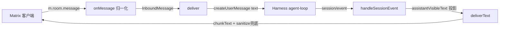

## 用户需求
彻底根治 Matrix 桥接插件把模型工具调用协议（如 `<invoke>`）当成文本泄漏到房间的问题，采用符合 harness 规范的主动投影方案，而非正则补丁打补丁；修复后产出设计文档，并为后续图片等非文字信息处理预留可扩展结构。

## 产品概述
dsh-matrix 是 DeepSeek Harness 的 Matrix 传输适配器。当前出站仅把 assistant 消息的 text 块透传到 Matrix，导致 agent 调用工具的 `tool-call` 结构化块在 Matrix 端不可见，模型被迫在 text 里裸写 `<invoke>` 协议而泄漏。本任务重构出站投影与入站归一化，让工具调用主动投影为可读文本，并预留媒体处理扩展点。

## 核心特性
- 出站主动投影 `tool-call` 块：把 harness 结构化工具调用渲染为 Matrix 可读文本（如「调用工具 name + 参数摘要」），使模型无需在 text 裸写协议，从根上消除 `<invoke>` 泄漏。
- 出站分层防御：`tool-call` 主动投影为主力，`sanitizeAssistantText` 正则降级为仅防护模型仍偶发裸写 `<invoke>` 的最后防线，职责分离清晰。
- 入站消息归一化：解析 Matrix `m.room.message` 的 msgtype，区分 text/notice 与 image/file/audio/video/location；媒体本轮识别为 `MediaBlock` 并生成占位文本，不静默丢弃，为后续图片处理留钩子。
- 设计文档：新增消息流与扩展点文档，说明 Matrix↔harness 事件契约对照、出站投影规范、入站媒体扩展结构。


## 技术栈
- 语言/运行时：TypeScript（strict）+ Node.js ESM，与现有项目一致。
- 宿主契约：`@deepseek-ai/dsh-session`、`@deepseek-ai/dsh-agent`、`@deepseek-ai/dsh-llm`、`@deepseek-ai/dsh-user-approval`（全部外部包，不改 harness 源码）。
- 构建：项目 `tsc -p tsconfig.json`（无 pnpm，用 `npx tsc`）。
- 测试：现有 `node --test` + ts 编译。

## 实现方案
**策略**：把出站从「只取 text 块」改为「按 content 顺序投影全部可见块」——text 原样、tool-call 主动序列化为可读行；入站从「只认 text」改为「按 msgtype 归一化为结构化 InboundMessage」。符合 harness 事件契约（content 是 ContentBlock[]，含 `type:'tool-call'` 块，字段 `id/name/arguments(JSON)`），不越界改 harness，保持适配器边界。

**关键决策与取舍**：
1. 出站主力改为 `assistantVisibleText(event)`：遍历 `event.data.message.content`，text 块拼接，`tool-call` 块用 `JSON.parse(arguments)`（失败回退原始字符串）投影成「调用工具 `name`\n  - key: value」。这直接对应 GUI 的 `tool-call` 块语义，保证 Matrix 与 GUI 历史一致，模型不再需要裸写协议。
2. `sanitizeAssistantText` 保留但降级：仅当 text 内仍含 `<invoke` 时触发，作为偶发兜底；注释明确「主力是 tool-call 投影，此为防线」。
3. 入站引入 `MediaBlock`（mimetype/mxc/url/filename/size）与 `InboundMessage { text?: string; media: MediaBlock[] }`。本轮对媒体生成占位文本（如「[收到图片: filename]」）并保留结构 + 注释 TODO 钩子，不实现 OCR/多模态（需额外工具，超出边界）。
4. 性能：投影为 O(blocks) 线性遍历，无正则全局扫描文本（仅兜底时按行检测）；入站媒体解析仅读取 m.room.message 既有字段，无额外 IO。

## 实现笔记
- 复用现有 `messageOf`、`chunkText`、`markdownToHtml`、`safeSend`；不新增运行时依赖。
- `tool-call.arguments` 为 JSON 字符串，`JSON.parse` 需 try/catch 兜底，避免坏参数导致整条消息投递失败。
- 入站不要静默吞媒体：至少占位提示，避免用户困惑（当前 bug 同类：丢信息）。
- 保持 `getRoomAgent` 单飞锁与 resume 兜底（本会话已验证）不被破坏。

## 架构设计

出站投影顺序与 GUI `toAssistantBlocks` 一致：`text` 原样、`tool-call` 投影为可读行；`reasoning` 块按现有策略（不投递或折叠，保持现状）。

## 目录结构
```
src/
  bridge.ts            # [MODIFY] 出站 assistantVisibleText（tool-call 主动投影）、sanitize 降级为兜底；入站 InboundMessage/MediaBlock 归一化、媒体占位
  types.ts 或 inline   # [MODIFY/NEW] 定义 MediaBlock、InboundMessage 结构（若独立文件则新增 src/inbound.ts）
  format.ts            # [MODIFY] 如有需要增加媒体占位文本辅助（可选）
docs/
  matrix-bridge-message-flow.md  # [NEW] 消息流、事件契约对照、出站投影规范、入站媒体扩展点 TODO
```
注：优先在 `bridge.ts` 内联 `MediaBlock`/`InboundMessage` 类型，避免新增文件分裂；若体量过大再抽 `src/inbound.ts`。

## 关键代码结构
```ts
// 出站：主动投影工具调用
interface ToolCallView { name: string; args: Record<string, unknown> | string }
function assistantVisibleText(event: AssistantMessageEvent): string | undefined

// 入站：媒体归一化（扩展点）
interface MediaBlock {
  readonly mimetype: string
  readonly url?: string      // 已解析 http(s) 时
  readonly mxc?: string      // Matrix content URI
  readonly filename?: string
  readonly size?: number
}
interface InboundMessage {
  readonly text?: string
  readonly media: MediaBlock[]
}
```


## Agent Extensions
### Skill
- **lsp-code-analysis**
  - Purpose: 在重构 bridge.ts 出站/入站逻辑时，精确导航 harness 的 ContentBlock/ToolCallBlock 类型定义与现有 `assistantText`、`deliverText`、`onMessage` 符号引用，避免误改契约字段。
  - Expected outcome: 确认 `tool-call` 块字段名（`name`/`arguments`）与 `createUserMessage` 入参结构，保证投影代码类型安全。
### SubAgent
- **code-explorer**
  - Purpose: 跨 packages（dsh-matrix/src、deepseek-harness/packages/llm、core/session）检索 `tool-call` 块在事件流中的真实形态与 GUI 投影实现，验证「主动投影」方案不偏离契约。
  - Expected outcome: 产出事件契约对照结论，确认出站投影字段与 GUI `hasVisibleContent` 语义一致。
