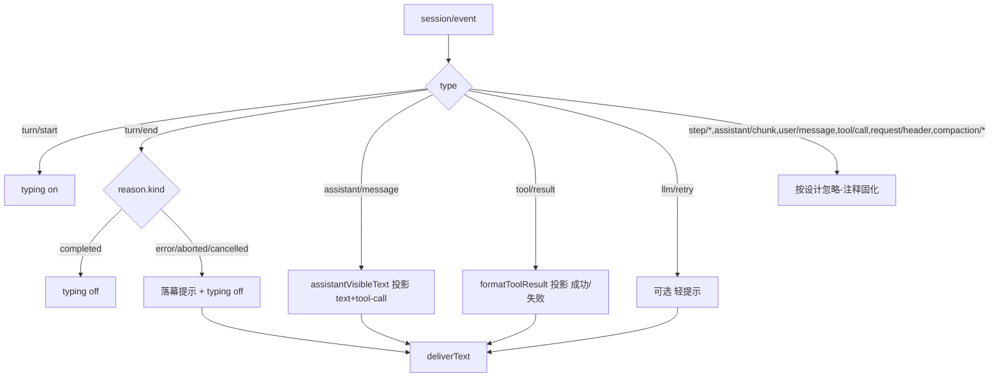

## 用户需求
用户要求从全面、规范的角度审计 dsh-matrix 插件在出站（harness → Matrix）一侧对 harness `session/event` 的覆盖是否完整，连同新发现的「工具执行结果/错误不可见」「turn 异常结束静默空转」问题，一并做出根治方案。先出方案、确认后再改，避免头痛医头。

## 产品概述
dsh-matrix 是 DeepSeek Harness 的 Matrix 传输适配器。出站侧 `handleSessionEvent` 当前只处理 `turn/start`/`turn/end`/`assistant/message` 三类事件，其余事件（尤其 `tool/result`、`turn/end` 的错误/中断原因、`llm/retry`）一律静默忽略，导致用户侧出现「调用了工具但没回复」「啥都没有（空转）」等困惑。本任务系统盘点到站事件处理矩阵，补齐可见性缺口，并在文档固化基线以防回归。

## 核心特性
- 新增 `tool/result` 出站投影：把工具执行结果/错误渲染为可读文本（成功/失败分别标注），消除「调了工具看不到结果」。
- 新增 `turn/end` 落幕提示：当 `reason.kind` 非 `completed`（error/aborted/cancelled 等）时，投递一条明确的结束原因，消除静默空转。
- 可选补充 `llm/retry` 轻提示：模型受限自动重试时告知用户，避免误以为卡死。
- 代码 `default` 分支固化「按设计忽略」清单与理由（step/*、assistant/chunk、user/message、tool/call、request/header、compaction/* 等），并同步到设计文档，防止误判遗漏与回归。


## 技术栈
- 语言/运行时：TypeScript（strict）+ Node.js ESM，与现有项目一致。
- 宿主契约：`@deepseek-ai/dsh-session`（SessionEventMap）、`@deepseek-ai/dsh-llm`（ContentBlock/ToolCallBlock/ToolResultBlock）。不改 harness 源码，保持适配器边界。
- 构建：`npx tsc -p tsconfig.json`（无 pnpm）；测试：`node --test`。
- 纯投影函数沿用既有约定放在 `src/format.ts`（formatToolCall/describeMedia 已在此，便于单测）；`src/bridge.ts` 只做事件分发与编排。

## 实现方案
**策略**：在 `handleSessionEvent` 的 switch 中补齐 `tool/result`、`turn/end`（错误落幕）、`llm/retry` 三个 case，投影逻辑下沉到 `src/format.ts` 的纯函数；`default` 分支显式列出「按设计忽略」的事件类型与理由（注释），保持与 GUI 可见性语义对齐但不 1:1 复刻 token 级可视化。

**关键决策与取舍**
1. `tool/result` 投影需要工具名，harness 的 `tool/result` 事件仅含 `message.source.callId`，不含 `name`。采用轻量配对：在 `AccountBridge` 维护 `toolNames: Map<string, string>`（key=callId），在 `assistant/message`/`tool/call` 路径或收到 `tool/call` 事件时记录 name；`tool/result` 到达时查表配对，查不到则回退为「工具（callId）」。turn 结束（`turn/end`）时清理该 turn 的条目，避免内存增长。这是最小且正确的方案，不必改 harness。
2. `turn/end` 落幕：仅当 `reason.kind !== 'completed'` 时 `safeSend` 一条「⚠️ 本次会话因 <kind> 结束（<说明>）」。`reason` 结构含 `kind` 与可选 `error`/`failure` 文本，需做可选链与兜底。
3. `tool/result` 与 `turn/end` 文本走既有 `deliverText` 管线（sanitize 兜底 + chunkText 分段），复用 `safeSend`，不新增发送通道。
4. `llm/retry` 设为可选低优先：仅在 `turn/end` 之前出现时轻提示，避免噪声；若实现简单则一并加入。
5. 性能：配对 Map 读写为 O(1)，turn 结束清理；投影为 O(blocks) 线性；无正则扫描、无额外 IO。

## 实现笔记
- 复用现有 `messageOf`、`chunkText`、`markdownToHtml`、`safeSend`；不新增运行时依赖。
- `tool/result` 的 `message.content[0]` 为 `ToolResultBlock`（含 `isError` 与 `content: ContentBlock[]`），投影时取文本摘要并截断（与 formatToolCall 800 字策略一致）。
- 错误原因优先用 `event.data.error`/reason 的结构化文本，回退到 `event.data.message` 的 isError 标记，避免坏数据导致整条投递失败（try/catch 兜底）。
- 保持 `getRoomAgent` 单飞锁与 resume 兜底不被破坏（本会话已验证）。
- `default` 分支改为显式注释「按设计忽略」清单，便于审计与防止误改。

## 架构设计
出站事件处理矩阵（整治后）：



## 目录结构
```
src/
  bridge.ts            # [MODIFY] handleSessionEvent 增 tool/result、turn/end 落幕、llm/retry case；新增 toolNames 配对 Map；default 显式忽略清单注释
  format.ts            # [MODIFY] 新增 formatToolResult(event)、formatTurnEnd(reason)、可选 formatRetry；纯函数便于单测
  matrix.ts            # [不变]
tests/
  format.media.test.mjs # [MODIFY] 补充 tool/result / turn/end / 配对 单测
docs/
  matrix-bridge-message-flow.md  # [MODIFY] 新增「出站事件覆盖矩阵」一节，逐类列出处理决策
```

## 关键代码结构
```ts
// src/format.ts 新增纯函数
function formatToolResult(event: Extract<SessionEvent, { type: 'tool/result' }>, toolName: string): string
function formatTurnEnd(reason: { kind: string; error?: unknown; failure?: unknown }): string | undefined

// src/bridge.ts 新增配对缓存（实例字段）
private readonly toolNames = new Map<string, string>() // callId -> name
```


## Agent Extensions
### SubAgent
- **code-explorer**
  - Purpose: 在最终实施前跨 packages 复核 harness `tool/result`、`turn/end` 的精确字段结构（reason 联合类型、event.data.error 形状）与 GUI trajectory 对 tool/result/turn/end/llm/retry 的可见性语义，确保投影代码类型安全、不偏离契约。
  - Expected outcome: 确认 `tool/result` 仅含 callId 不含 name（需配对）、`turn/end.reason` 的 kind 枚举与错误字段，作为实现与单测的权威依据。
